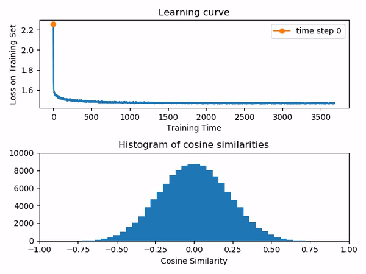

# Impact of Weight-Space Symmetries on Neural Network Training

Weight configurations where two or more weight vectors are identical have been studied as overlap singularities. Furthermore, if these points are critical points of the loss function being optimized, they are termed as permutation points and have been proven to be saddle points. My [Master thesis](https://www.dropbox.com/s/8z1i7377fglockg/Master_thesis_Manu_Srinath_Halvagal.pdf?dl=0) is an attempt to empirically study if and when such pathological configurations have a practical impact on neural network optimization.

## Using this package

**Requirements:** PyTorch, NumPy, Matplotlib

To generate the simulations described in the thesis, modify appropriately the `experiment_settings.yaml` file and run `main.py`. The jupyter notebooks provided also present some examples of how to use the plotting modules.

## Detecting high weight vector overlaps

A direct way to detect if two or more weights are becoming aligned during training is to monitor the histogram of the cosine similarities between every weight vector of a given hidden layer. All data presented here are from networks trained on the MNIST digit classification task.

1. A typical network with a single hidden layer (40 hidden units)

2. A network with two hidden layers (20, 500), i.e, an overparametrized layer following a bottleneck

We see that high overlaps very close to 1 are not specifically encountered even with a high number of units. However the overparametrized layer in the second case shows some interesting behaviour. We can plot the pairwise cosines at different stages of training as a function of their initial values to see whether units with partially-aligned weight vectors are able to decorrelate throughout training.

